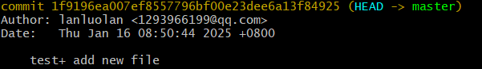
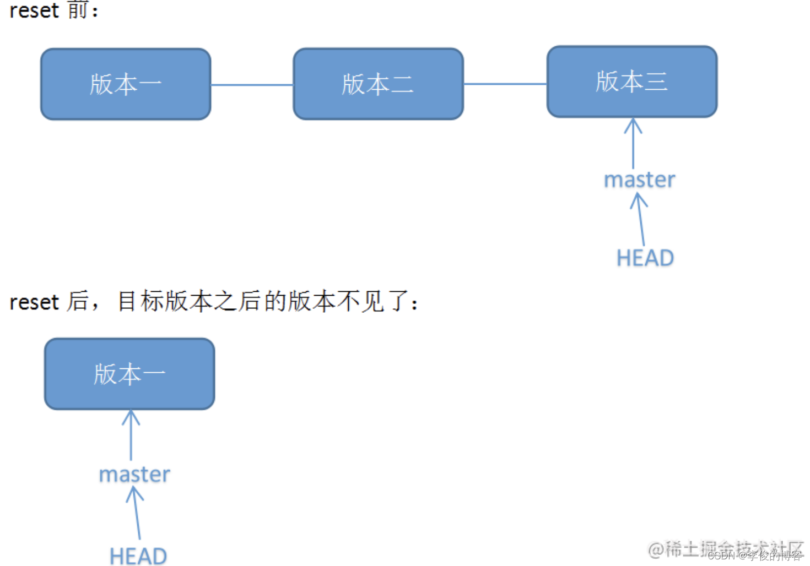

# Git operation

## 0.Linux
创建空文件:
```
touch [fileName]
```

创建文件夹:
```
mkdir [dicName]
```

删除文件:
```
rm [fileName]
```

删除文件夹:
```
rm -r [dicName]
```

显示当前路径:
```
pwd
```

列出目录内容:
```
ls
    -a  显示隐藏文件
    -l  显示详细信息
    -lh 以人类可读格式显示文件大小 
```

连接文件并打印到标准输出设备上（屏幕）:
```
cat [fileName] 查看文件内容
    [file1 file2] 连接多个文件并查看
    [file1 >> file2] 将输出追加到另一个文件中
```

重新初始化终端:
```
reset
```

清屏:
```
clear
```

命令历史:
```
history
```

帮助:
```
help
```

退出:
```
exit
```

## 1.0 配置Git环境
用户名配置
```
git config --global user.name "用户名"
```

邮箱配置
```
git config --global user.email "邮箱"
```

## 1.1 初始化：
初始化本地仓库:
```
git init
```

连接远程仓库:
```
git remote add origin https://…….git
```

## 1.2 工作

查看状态:
```
git status
```

查看历史提交日志:
```
git log
```
  
第一行：commit_id（指向某仓库）
第二行：用户名<邮箱>
第三行：提交时间


添加文件:
```
git add [fileName]
git add . 添加所有文件
```

添加注释:
```
git commit -m "描述信息"
```

改写已提交注释：
```
git commit --amend 进入vim编辑器修改
```

提交origin库下的master分支:
```
git push origin master
```

下拉origin库下的master分支:
```
git pull origin master
``` 

## 1.3 分支

创建并切换到develop分支:
```
git checkout -b develop
```

删除develop分支:
```
git checkout -d develop
```

查看本地分支:
```
git branch -a
```

合并本地分支(合并develop到当前分支):
```
git merge develop
```

查看远程仓库分支:
```
git remote show origin
```

删除远程仓库分支(develop):
```
git push origin --delete develop
```

更新本地的远程跟踪分支列表:
```
git fetch -p
```

重命名当前分支(master->main):
```
git branch -m  master  main
```


## 1.4错误回退
0恢复文件（Disk）
```
git restore <file>  #恢复文件到最近一次提交时的状态
git restore .       #恢复所有文件到最近一次提交时的状态（不包括未跟踪的文件）
git restore --source=<commit_id> <file>     #恢复指定文件到指定commit_id的版本
git restore --staged <file>     #取消暂存区内的文件修改
```
1.查看分支提交历史,确认回退版本commit_id
```
git log
```
2.进行版本回退（本地仓库Local）
方案一：
```
git reset <commit_id>    #回退到指定历史版本
git reset HEAD^          #回退到上一个版本
git reset HEAD~n         #回退n个版本（当前版本也算） 

--soft ：回退Local，不回退Staging,Disk
--mixed(默认) ：回退Local和Staging，不回退Disk
--hard ：回退Local和Staging和Disk

git push origin <branchName> -f #强制推送到远程仓库(HEAD不同步-推荐私有分支)
```

              


方案二：
```
git revert <commit_id>                    #撤销指定历史版本
git revert <commit_id1>~..<commit_id2>    #撤销指定区间的版本
git revert HEAD^                          #撤销上一个版本

注意：回退Disk,不回退Local和Staging
```


3.发布版本更新（远程仓库）
```
git push origin master
```