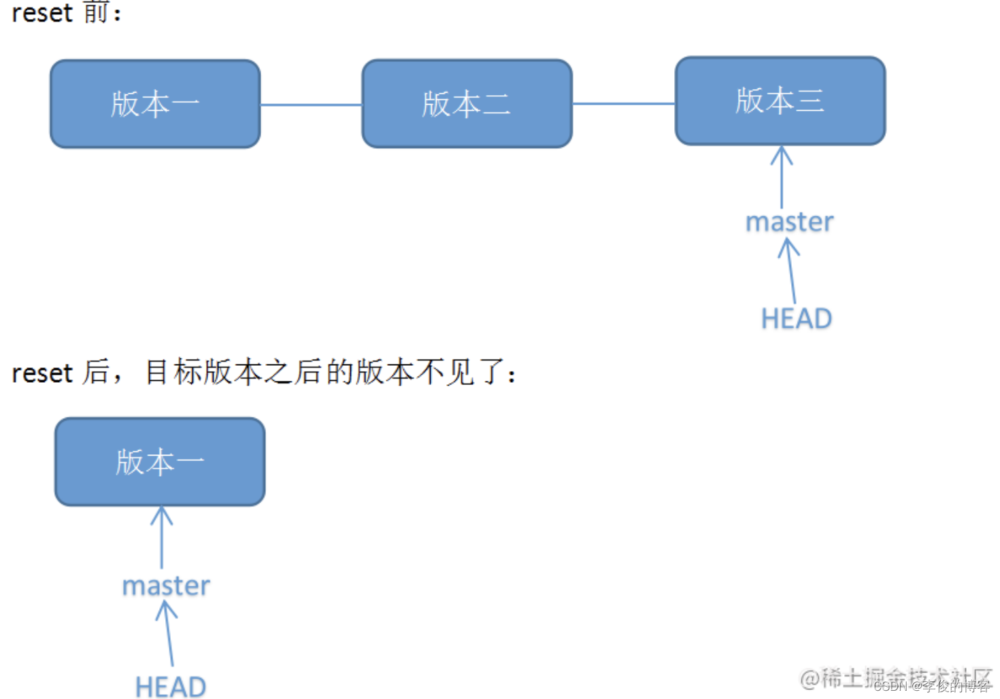
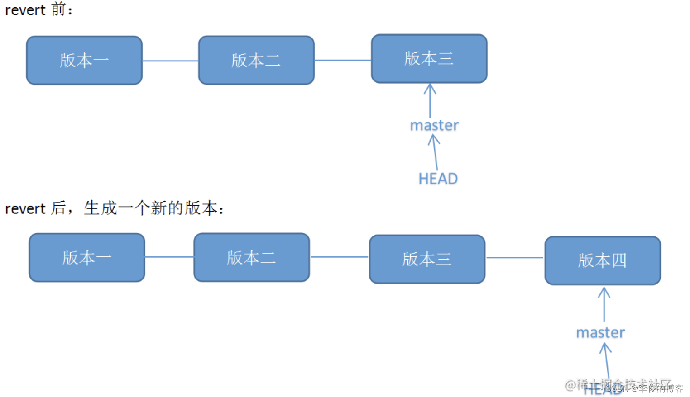

# Git operation 

## 0.Linux
创建文件:
```
touch xxx
```

创建文件夹:
```
mkdir xxx
```

显示当前路径:
```
pwd
```

删除文件:
```
rm xxx
```

删除文件夹:
```
rm -r xxx
```

重新初始化终端:
```
reset
```

清屏:
```
clear
```

命令历史:
```
history
```

帮助:
```
help
```

退出:
```
exit
```

## 1.1 初始化：
初始化本地仓库:
```
git init
```

连接远程仓库:
```
git remote add origin https://…….git
```

## 1.2 工作

查看状态:
```
git status
```

添加所有文件:
```
git add .
```

添加注释:
```
git commit -m "xxx"
```

提交origin库下的master分支:
```
git push origin master
```

下拉origin库下的master分支:
```
git pull origin master
``` 

## 1.3 分支

创建并切换到develop分支:
```
git checkout -b develop
```

删除develop分支:
```
git checkout -d develop
```

查看本地分支:
```
git branch -a
```

合并本地分支(合并develop到当前分支):
```
git merge develop
```

查看远程仓库分支:
```
git remote show origin
```

删除远程仓库分支(develop)：
```
git push origin --delete develop
```

更新本地的远程跟踪分支列表:
```
git fetch -p
```

重命名当前分支(master->main)：
```
git branch -m  master  main
```
## 1.4错误回退
1.查看分支提交历史，确认回退版本commit_id
```
git log
```
2.进行版本回退（本地仓库）
方案一：
```
git reset --hard <commit_id>
```





方案二：
```
git revert <commit_id>
```





3.发布版本更新（远程仓库）
```
git push origin master
```

