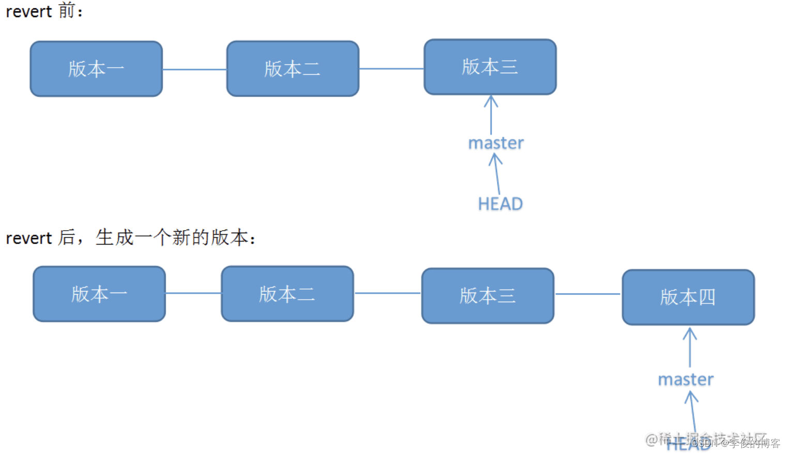

# Git operation


## 0.Linux
1. 创建空文件:
```
touch [fileName]
```

2. 创建文件夹:
```
mkdir [dicName]
```

3. 删除文件:
```
rm [fileName]
```

4. 删除文件夹:
```
rm -r [dicName]
```

5. 显示当前路径:
```
pwd
```

6. 列出目录内容:
```
ls
ls -a                       # 显示隐藏文件
ls -l                       # 显示详细信息
ls -lh                      # 以人类可读格式显示文件大小 
```

7. 连接文件并打印到标准输出设备上（屏幕）:
```
cat [fileName]              # 查看文件内容
cat [file1 file2]           # 连接多个文件并查看
cat [file1 >> file2]        # 将输出追加到另一个文件中
```

8. 重新初始化终端:
```
reset
```

9. 清屏:
```
clear
```

10. 命令历史:
```
history
```

11. 帮助:
```
help
```

12. 退出:
```
exit
```

## 1.0 配置Git环境
1. 用户名配置
```
git config --global user.name "用户名"
```

2. 邮箱配置
```
git config --global user.email "邮箱"
```

## 1.1 初始化：
1. 初始化本地仓库:
```
git init
```

2. 连接远程仓库:
```
git remote add origin https://…….git
```

3. 查询远程仓库:
```
git remote                  # 远程仓库名称
git remote -v               # 远程仓库详细信息
```


4. 首次从远程仓库获取代码库的完整副本:
```
git clone https://…….git
```

## 1.2 工作

1. 查看状态:
```
git status
```

2. 查看历史提交日志:
```
git log
git log --all               # 显示所有分支
git log --pretty=oneline    # 显示一行
git log --abbrev-commit     # 显示简略的commit_id
git log --graph             # 以图示显示
```
  
第一行：commit_id（指向某仓库）
第二行：用户名<邮箱>
第三行：提交时间

3. 添加文件:
```
git add [fileName]
git add .                   # 添加所有文件
```

4. 添加注释:
```
git commit -m "描述信息"
```

5. 改写已提交注释：
```
git commit --amend （进入vim编辑器修改）
```

6. 提交origin库下的master分支:
```
git push origin master
```

7. 拉取origin库:（fetch+merge）
```
git pull origin             # 拉取所有分支
git pull origin master      # 拉取master分支
```

## 1.3 分支

1. 抓取origin库:
```
git fetch origin            # 抓取所有分支
git fetch origin master     # 抓取master分支
```

2. 创建并切换到develop本地分支:
```
git checkout -b develop
git checkout develop        # 切换到develop分支
```

3. 删除develop分支:
```
git branch -d develop       # 删除本地分支
（git branch -D develop 强制删除）
git push origin -d develop  # 删除远程分支
```

4. 查看分支(先fetch):
```
git branch -a               # 远程仓库分支+本地分支
git branch                  # 查看本地分支
git branch -r               # 查看远程分支
```

5.本地分支与远程分支关联:
```
git branch -vv              # 查看本地分支关联的远程分支
git branch -u origin/master # 本地分支关联远程分支
```

6. 合并本地分支(合并develop到当前分支):
```
git merge develop
```

7. 查看远程仓库分支:
```
git remote show origin
git remote prune origin    # 刷新本地分支仓库
```

8. 重命名当前分支(master->main):
```
git branch -m  master  main
```

9. 保存当前工作状态:
```
git stash
git stash list              # 查看stash列表
（保存后才可切换分支checkout）
git stash pop               # 恢复stash
```

10.  同步分支修改部分到当前分支：
```
git cherry-pick <branchName>
```

11. 首次推送本地分支到远程:
```
git push -u origin master   # -u:自动关联分支
```

## 1.4版本回退
0. 恢复文件（Disk）
```
git restore <file>          # 恢复文件到最近一次提交时的状态(包括删除操作)
git restore .               # 恢复所有文件到最近一次提交时的状态（不包括未跟踪的文件）
git restore --source=<commit_id> <file> # 恢复指定文件到指定commit_id的版本
git restore --staged <file> # 取消暂存区内的文件修改
```

1. 查看分支提交历史,确认回退版本commit_id
```
git log
```
查看提交历史（可查看删除记录）
```
git reflog  
```

2. 进行版本回退（本地仓库Local）
方案一：
```
git reset <commit_id>    # 回退到指定历史版本
git reset HEAD^          # 回退到上一个版本
git reset HEAD~n         # 回退n个版本（当前版本也算） 

--soft ：回退Local，不回退Staging,Disk
--mixed(默认) ：回退Local和Staging，不回退Disk
--hard ：回退Local和Staging和Disk

git push origin <branchName> -f # 强制推送到远程仓库(HEAD不同步-推荐私有分支)
```

              


方案二：
```
git revert <commit_id>                    # 撤销指定历史版本
git revert <commit_id1>~..<commit_id2>    # 撤销指定区间的版本
git revert HEAD^                          # 撤销上一个版本（非当前版本）

注意：回退Disk,不回退Local和Staging(推荐公有分支)
```




3. 发布版本更新（远程仓库）
```
git push origin master
```

## 1.5额外配置
1. 添加文件至忽略列表
若存在文件无需纳入Git管理的情况，在工作目录中创建一个.gitignore文件，并添加需要忽略的文件名或路径。
```
# 忽略操作系统产生的文件
.DS_Store
Thumbs.db

# 忽略编译生成的文件
*.class
*.pyc
*.o
*.exe
*.dll
*.lib
*.pdb

# 忽略包管理工具生成的文件
node_modules/
pip-wheel-metadata/
__pycache__/
dist/
build/

# 忽略IDE或编辑器生成的文件
*.sublime-project
*.sublime-workspace
*.idea
.project
.classpath
.settings/

# 忽略日志文件和数据库文件
*.log
*.sqlite3

# 忽略虚拟环境文件
.env
venv/

# 忽略临时文件
*~
tmp/
temp/
```

