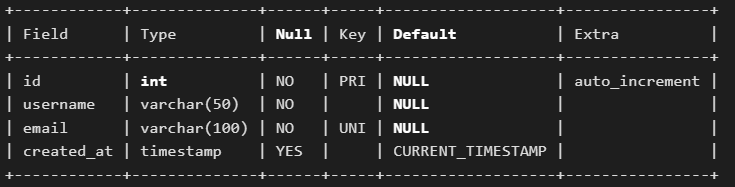

# Mysql

默认端口号：3306

## 初始化

1. 登录:
```
mysql -u root -p
```

2. 退出:
```
exit
```

3. 显示当前数据库的版本信息以及连接用户名：
```
select version(),user();
```

## 数据库

1. 查看数据库:
```
show databases;
```
2. 使用数据库:
```
use xxx;
```
3. 创建数据库:
```
create database xxx;
```
4. 删除数据库:
```
drop database xxx;
```
5. 导入sql文件-"文件路径"（先建立同名数据库）：
```
source xxx.sql;
```


## 数据表
1. 查看所有数据表:
```
show tables;
```
2. 创建数据表：
```
create table 表名(
    id INT AUTO_INCREMENT PRIMARY KEY,              // AUTO_INCREMENT:自增
                                                    // PRIMARY KEY:主键
    username VARCHAR(50) NOT NULL,                  // NOT NULL:不为空
    email VARCHAR(100) UNIQUE NOT NULL,             // UNIQUE:值唯一
    created_at TIMESTAMP DEFAULT CURRENT_TIMESTAMP  // DEFAULT CURRENT_TIMESTAMP:默认值为当前时间戳
); 
```
3. 查看表结构
```
DESCRIBE 表名;
```

4. 删除数据表
```
DROP TABLE 表名;
```
## 数据操作
1. 插入数据
```
INSERT INTO 表名 (username, email) VALUES ('Alice', 'alice@example.com');
```
2. 查询数据
```
select * from 表名 where xxx='xxx' and xxx='xxx';
```
3. 删除数据
```
delete from 表名 where xxx='xxx';
```
4. 更新数据
```
update 表名 set xxx='xxx' where xxx='xxx';
```