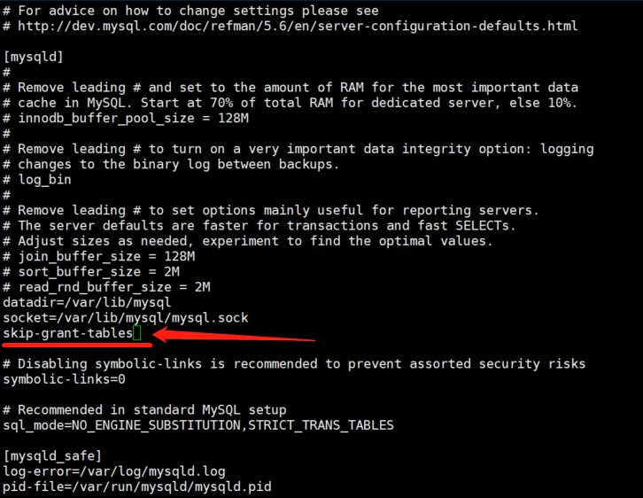

# Server服务器

# Mysql

## 1.卸载mysql
### 使用 rpm 命令查看已安装的安装包

1. 输入命令检查是否安装了mysql软件:
```
rpm -qa | grep mysql
```

2. 如果查到了相关文件，使用“ rpm -e 文件名 ”的命令删除该文件:
```
rpm -e 文件名
```

### 使用yum卸载安装的mysql

1. 使用yum卸载安装的mysql:
```
yum remove mysql mysql-server mysql-libs mysql-server
```

### 搜索mysql文件
1. 全局搜索名称包含 mysql 的所有文件:
```
find / -name '*mysql*'
```

2. 删除搜索出来的所有 mysql 文件:
```
rm -rf xxx
```

## 2.下载mysql安装文件
1. 下载:
```
wget https://dev.mysql.com/downloads/repo/yum/mysql80-community-release-el7-7.noarch.rpm
```
* linux6:6-7
* linux7:7-7
* linux8:8-5
* linux9:9-1

2. rpm安装:
```
rpm -ivh mysql80-community-release-el7-7.noarch.rpm
```

3. yum安装mysql-server:
```
yum install -y mysql-server
```
* 如果没有权限的，可以执行下面命令设置权限（root用户不用执行）：
    ```
    chown -R mysql:mysql /var/lib/mysql/
    ```

## 3.启动服务

1. 启动:
```
systemctl start mysqld.service
```

2. 查看mysql运行状态:
```
service mysqld status
```

3. 查看初始密码:
```
grep 'password' /var/log/mysqld.log
```

4. 登录:
```
mysql -u root -p
``` 

## 4.修改mysql密码

### 设置跳过登录密码:

1. 打开mysql的配置文件:
```
vi /etc/my.cnf
```

2. 打开文件后按 a 键进入编辑模式，在 [mysqld] 配置的下面添加 skip-grant-tables,然后按 esc 键，输入 :wq 保存文件。


### 重启mysql服务:
```
service mysqld restart
```

### 进入mysql:
```
mysql -u root -p
```

### 修改用户登录密码:
1. 进入 mysql 库:
```
use mysql
```

2. 修改密码:
```
update user set password=password('你设置的密码') where User='root' and Host='localhost';
```

3. 更新缓存:
```
flush privileges;
```

4. 退出mysql
```
exit
```

### 还原配置文件
1. 重新进入 my.cnf 文件注释掉 skip-grant-tables

2. 再次重启mysql服务


# 后端项目运行

## 1.代码配置

* host='0.0.0.0',port=端口号
* 云服务器端口配置
* py文件运行时若有中文注释可在代码头部加以下代码：
    ```
    # -*- coding: UTF-8 -*-
    ```

## 2.运行

1. 使用 nohup 命令挂起服务：
```
nohup python -u xxx.py > xxx_out.out 2>&1 &
```
* 说明：
  * 末尾的“&”：表示后台运行程序
  * “nohup” ：保证程序不被挂起
  * “python”：是执行python代码的命令
  * “-u”：是为了禁止缓存，让结果可以直接进入日志文件 xxx_out.out（如果不加-u，则会导致日志文件不会实时刷新代码中的print函数的信息）
  * “xxx.py”：是欲执行的python的源代码文件
  * “xxx_out.out”：是输出的日志文件
  * “>”：是指将打印信息指定到日志文件
  * “2>&1”：将标准错误输出转变化标准输出，可以将错误信息也输出到日志文件中（0-> stdin, 1->stdout, 2->stderr）

2. 查看脚本是否已在后台执行：
* 使用 jobs 命令；
    ```
    jobs
    ```
* 使用 ps -ef|grep python 或者 ps -ef|grep Job 命令，查看进程；
    ```
    ps -ef|grep python
    ```
    ```
    ps -ef|grep Job
    ```
* 使用 ps aux 命令，查看程序的进程号；
    ```
    ps aux
    ```

3. 关闭指定进程号的程序。
```
kill -9 进程号
```
