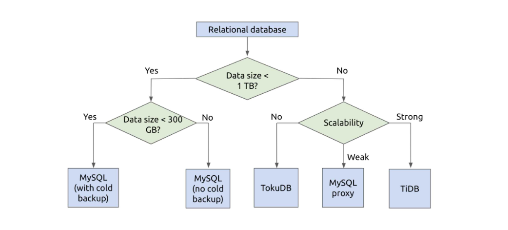
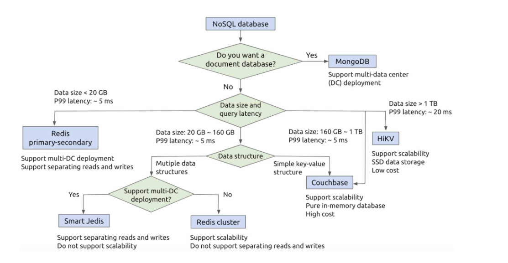
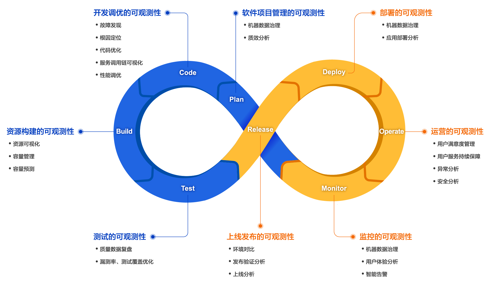

# 1.版本控制与文档
### 版本控制：Git

+ [官方文档](https://git-scm.com/book/zh/v2)
+ [视频教学](https://www.bilibili.com/video/BV1pW411A7a5)

### 服务器：GitHub，GitLab，码云
### 文档：Markdown

+ [GitHub教程文档](https://guides.github.com/features/mastering-markdown/)

# 2.UI/UX设计
### 原型设计工具：Axure RP，墨刀
### 设计原则、规范：

+ [Android](https://material.io/design/)
+ [iOS](https://developer.apple.com/design/human-interface-guidelines/ios/overview/themes/)

# 3.软件架构

### RESTFUL
（[RESTful](http://www.ruanyifeng.com/blog/2011/09/restful.html)架构是移动互联网中最常用的技术，服务端和前端分离）

### 关系数据库的选择

### NOSQL的选择

### WEB框架
（接收客户端的请求，处理后将结果返回给客户端）

+ Python: [Flask](http://flask.pocoo.org/)、[Django](https://www.djangoproject.com/)、[Tornado](http://www.tornadoweb.org/en/stable/)
+ [Node.js](https://nodejs.org/en/): [Koa](https://koajs.com/)、[Express](https://expressjs.com/zh-cn/) 
+ Ruby: [Ruby on Rails](https://rubyonrails.org/)
+ Go: [Beego](https://beego.me/)、[Iris](https://iris-go.com/)
+ Java: [Spring MVC](https://docs.spring.io/spring/docs/current/spring-framework-reference/web.html)
+ [PHP](http://php.net/)

### 服务端、客户端交互

+ [RESTful API](http://www.ruanyifeng.com/blog/2011/09/restful.html)
+ [RPC](https://en.wikipedia.org/wiki/Remote_procedure_call): [grpc](https://grpc.io/)、[thrift](https://thrift.apache.org/)

### 移动端

+ [Android](https://developer.android.com/?hl=zh-cn)
+ [iOS](https://developer.apple.com/)
+ [微信小程序](https://developers.weixin.qq.com/miniprogram/dev/framework/)
+ Web技术: [自适应网页设计](http://www.ruanyifeng.com/blog/2012/05/responsive_web_design.html)，动态生成原生界面（[React Native](https://facebook.github.io/react-native/)、[Weex](https://weex.apache.org/cn/guide/)、[uni-app](https://github.com/dcloudio/uni-app)）

### WEB开发

+ [HTML](https://www.w3schools.com/html/html5_intro.asp): HTML定义了页面的主要结构
+ [CSS](http://www.w3school.com.cn/css3/index.ASP): CSS用于实现页面的外观(参考Bootstrap等CSS框架)
+ [Javascript](https://wangdoc.com/javascript/): [jQuery](https://jquery.com/)、[React](https://reactjs.org/)、[Vue](https://cn.vuejs.org/index.html)、[Angular](https://angular.io/)

### BAAS
(后端作为一种服务来提供给用户)

+ [Leancloud](https://leancloud.cn/)
+ [Bmob](https://www.bmob.cn/)
+ [Firebase](https://firebase.google.com/)
+ [Parse](https://parseplatform.org/)

# 4.RESTFUL API

### RESTFUL架构
(REST = Representational State Transfer)

+ [RESTful架构的解释](http://www.ruanyifeng.com/blog/2011/09/restful.html)

### 设计规范

+ [RESTful API 设计指南](http://www.ruanyifeng.com/blog/2014/05/restful_api.html)
+ [RESTful API 设计最佳实践](https://www.vinaysahni.com/best-practices-for-a-pragmatic-restful-api)([中文](https://www.oschina.net/translate/best-practices-for-a-pragmatic-restful-api))
+ 参考现有系统的API设计（如[GitHub API](https://developer.github.com/v3/?)）

### 数据格式

+ [JSON](http://www.json.org/)
+ [XML](https://www.w3.org/XML/)
+ [JSON vs XML](https://restfulapi.net/json-vs-xml/)

### 测试

+ [Apifox](https://www.apifox.cn/)
+ [Postman](https://chrome.google.com/webstore/detail/postman-rest-client/fdmmgilgnpjigdojojpjoooidkmcomcm)
+ [httpie](https://github.com/jkbrzt/httpie)

### 资源
+ [Awesome REST](https://github.com/marmelab/awesome-rest)

### RPC

+ Remote Procedure Call，远程过程调用
+ 远程请求服务，无需了解底层网络协议
+ [grpc](https://grpc.io/)
+ [thrift](https://thrift.apache.org/)

### [微服务](https://github.com/mfornos/awesome-microservices)

+ 将应用程序分解为一组松耦合的服务
+ 服务间通过RESTful API及类似技术进行通信

# 5.Android

### 框架
([Android Architecture Blueprints](https://github.com/android/architecture-samples))

+ [Architecture Components](https://developer.android.google.cn/jetpack#architecture-components)（官方）
+ [MVP](https://github.com/android/architecture-samples/tree/todo-mvp/)
  + View: 数据展示、界面、用户交互。Activity或Fragment作为View层。
  + Model: 数据层，不仅仅是数据模型，还包括数据存取，如数据库的读写、网络数据请求等。
  + Presenter: View与Model的桥梁，对业务逻辑进行处理。
+ [Clean](https://github.com/android/architecture-samples/tree/todo-mvp-clean/)

### 其他架构

+ [Dagger](https://github.com/android/architecture-samples/tree/todo-mvp-dagger/)
+ [RxJava](https://github.com/android/architecture-samples/tree/todo-mvp-rxjava/)
+ [databinding](https://github.com/android/architecture-samples/tree/todo-mvvm-databinding/)
+ [mvvm-live](https://github.com/android/architecture-samples/tree/todo-mvvm-live/)

### 功能拓展

+ 位置信息
  + [LBS](https://en.wikipedia.org/wiki/Location-based_service)
  + [百度地图](http://lbsyun.baidu.com/index.php?title=androidsdk)
  + [高德地图](https://lbs.amap.com/)

+ 第三方库
  + [一般的库](https://github.com/wasabeef/awesome-android-libraries)
  + [第三方的UI库](https://github.com/wasabeef/awesome-android-ui)
  + [App常用第三方库整理](https://www.jianshu.com/p/4c28321def41)
  + C/C++写的库，可以使用[NDK](https://developer.android.com/ndk/)

# 6.数据库应用

### ER模型
(实体关系模型，是数据库系统设计的常用工具。)

+ [Visio](https://products.office.com/zh-cn/visio/flowchart-software)
+ [Dia](http://dia-installer.de/)

### 数据库迁移

+ 对关系数据库增量、可逆变化的管理
+ 用编程的方式维护数据库的变化
+ 在不同版本的数据库之间进行转换
+ Ruby on Rails: Active Record
+ Python: [alembic](https://pypi.org/project/alembic/)
+ Node.js: [knex](https://knexjs.org/)、[Sequelize](http://docs.sequelizejs.com/)

### ORM
(对象关系映射，把关系数据库和面向对象技术中对象关联起来)

+ 文档数据库(MongoDB等): [ODM](https://docs.mongodb.com/ecosystem/drivers/#mongodb-odm-object-document-mapper)
+ Ruby on Rails: [Active Record](https://ruby-china.github.io/rails-guides/active_record_basics.html)
+ Python: [SQLAlchemy](https://www.sqlalchemy.org/)
+ Java: [Hibernate](http://hibernate.org/)
+ Node.js: [Sequelize](http://docs.sequelizejs.com/)等。

### 数据库缓存

+ 提高数据的访问速度
+ 读数据时，先从内存缓存中读取，如果缓存中没有再读取数据库，并把数据库中读取的数据保存到缓存中
+ 通常采用[Redis](https://redis.io/)、[Memcached](https://memcached.org/)等

# 7.WEB技术
([w3schools](https://www.w3schools.com/))

### HTML5 [CANVAS](https://www.w3schools.com/Html/html5_canvas.asp)

+ 实现丰富的画图效果
+ 通过[WebGL](https://www.html5rocks.com/en/tutorials/webgl/webgl_fundamentals/)可以实现强大的三维图形效果
+ [Awesome HTML5](https://github.com/diegocard/awesome-html5)

### CSS

+ 全称层叠样式表(Cascading Style Sheets)
+ 用于描述 HTML 文档的样式，最新标准是CSS3
+ 核心概念是[盒模型](https://developer.mozilla.org/zh-CN/docs/Web/CSS/CSS_Box_Model)
+ 预处理语言[LESS](https://github.com/less/less.js)、[Sass](https://github.com/sass/sass)

### 响应式设计技术

+ 使网页在不同设备上展现不同的外观
+ 桌面、移动设备统一
+ CSS 框架: [Bootstrap](http://getbootstrap.com/)、[Milligram](http://milligram.io/)、[Pure](https://purecss.io/)等
+ 参考:[ Awesome CSS Framework](https://github.com/troxler/awesome-css-frameworks)、[Awesome CSS](https://github.com/awesome-css-group/awesome-css)

### JAVASCRIPT

+ 用于定义页面元素的行为
+ [ES6](http://es6.ruanyifeng.com/)：非常重要的一个版本
+ [TypeScript](https://www.typescriptlang.org/): 静态类型检查，可编译成JavaScript
+ 相关资源及包参见[Awesome JavaScript](https://github.com/sorrycc/awesome-javascript)

### JAVASCRIPT框架

+ [jQuery](https://jquery.org/)
+ [React](https://reactjs.org/)
+ [Vue](https://cn.vuejs.org/index.html)
+ [Angular](https://angular.io/)

### JAVASCRIPT工具
+ 包管理: [npm](https://www.npmjs.com/), [yarn](https://yarnpkg.com/)
+ 资源打包: [webpack](https://github.com/webpack/webpack), [Parcel](https://github.com/parcel-bundler/parcel)

### 移动端框架

+ [React Native](https://reactnative.dev/)
+ [uni-app](https://uniapp.dcloud.io/)
+ [Flutter](https://flutter.dev/)

# 8.软件测试

### 软件测试

+ 现代软件开发中非常重要的一个环节
+ 保证软件质量的重要手段
+ [Awesome Software Quality](https://github.com/ligurio/awesome-software-quality)

### 单元测试

+ 保证代码片段的正确性
+ 通常是对函数进行测试
+ 写程序之前应先写好代码的单元测试
+ 每次修改程序后运行单元测试以保证代码的正确性
+ [TDD](https://github.com/unicodeveloper/awesome-tdd)（测试驱动开发）

### 单元测试工具

+ Python: nose、unittest
+ Java: JUnit
+ JavaScript: mocha、jest

### 代码覆盖率
(测量源代码中的哪些语句在测试中被执行，哪些语句尚未被执行)

| 编程语言   | 代码覆盖率工具 |
| ---------- | -------------- |
| C/C++      | Gcov           |
| Java       | JaCoCo         |
| JavaScript | Istanbul       |
| Python     | Coverage.py    |
| Golang     | cover          |

### 自动化测试

+ 使用特定软件来执行测试流程
+ 比较实际结果与预期结果之间的差异
+ 参考[Awesome Test Automation](https://github.com/atinfo/awesome-test-automation)来帮助实现测试自动化
+ [持续集成](http://www.ruanyifeng.com/blog/2015/09/continuous-integration.html)中非常重要的组成部分

### GITHUB自动测试

+ [GitHub Actions](https://docs.github.com/en/actions)
+ [自动测试](https://docs.github.com/en/actions/automating-builds-and-tests/about-continuous-integration)

# 9.持续集成

### 持续集成

+ 基于自动测试、部署技术
+ 开发人员提交新代码之后，立刻进行构建、测试
+ 根据测试结果，确定新代码能否正确集成

### GITHUB ACTIONS

+ GitHub 的持续集成服务，于2018年10月推出
+ [GitHub Actions 入门教程](https://www.ruanyifeng.com/blog/2019/09/getting-started-with-github-actions.html)
+ [GitHub Actions 快速入门](https://www.ruanyifeng.com/blog/2019/09/getting-started-with-github-actions.html)

### 自动测试

+ [Python/Node.js单元测试](https://docs.github.com/cn/actions/automating-builds-and-tests/building-and-testing-nodejs-or-python?langId=py)
+ [Java&Gradle单元测试](https://docs.github.com/cn/actions/automating-builds-and-tests/building-and-testing-java-with-gradle)

### GITHUB单元测试覆盖率徽标

+ [Github徽标](https://shields.io/)

# 10.TDD实践
([测试驱动开发TDD讲解：理论+实操](https://www.bilibili.com/video/BV1yM4y1G7rz))

+ Java + JUnit
+ Python + pytest

# 11.系统部署

### CM软件
+ [Ansible](https://www.ansible.com/)
+ [Chef](https://www.chef.io/)
+ [Puppet](https://puppet.com/)

### 虚拟机工具
+ [Vagrant](https://www.vagrantup.com/)是基于虚拟机的开发工具
+ [Openstack](https://www.openstack.org/)及大部分云平台都提供了虚拟机管理功能

### 容器技术
+ 虚拟机缺点: 运行的开销较大
+ 容器技术——特别是[Docker](https://www.docker.com/)弥补了虚拟机的缺点
+ DOCKER
  + 可视为一个隔离的进程
  + 开销和进程相当
  + 满足用户对资源的隔离和虚拟
  + 没有虚拟机功能强大，但满足了系统部署的大部分需求

### 容器工具
+ 最热门的部署工具[Kubernetes](https://kubernetes.io/)
+ [docker-compose](https://docs.docker.com/compose/)
+ [docker-swarm](https://docs.docker.com/engine/swarm/)

### 持续
+ 持续集成
  + 基于自动测试、部署技术  
  + 开发人员提交新代码之后，立刻进行构建、测试
  + 根据测试结果，确定新代码能否正确集成
+ 持续交付
  + 将集成后的代码部署到「类生产环境」
  + 如果代码没有问题，可以继续部署到生产环境中
+ 持续部署
  + 在持续交付的基础上
  + 把部署到生产环境的过程自动化

# 12.云服务模型

### IAAS
+ Infrastructure as a Service（基础设施即服务）
+ 服务商提供底层/物理层基础设施资源（服务器，数据中心，环境控制，电源，服务器机房）
+ 客户自己部署和执行操作系统或应用程序等
+ DigitalOcean, Linode, Rackspace, Amazon Web Services (AWS), Cisco Metapod, Microsoft Azure, Google Compute Engine (GCE), 阿里,腾讯,青云,ucloud

### PAAS
+ Platform as a Service（平台即服务）
+ 服务商提供基础设施底层服务，提供操作系统（Windows，Linux）、数据库服务器、Web服务器、域控制器和其他中间件，以及服务模型中的备份服务等中件层服务。例如IIS，.NET，Apache，MySQL …
+ 客户自己控制上层的应用程序部署与应用托管的环境
+ AWS Elastic Beanstalk, Windows Azure, Heroku, GAE

### SAAS
+ Software as a Service（软件即服务）
+ 服务商提供基于软件的解决方案，满足客户最终需求；如OA、CRM、MIS、ERP、HRM、CM、Office 365、iCloud、G Suite等应用
+ 客户不需考虑任何形式的专业技术知识，获得完整的软件包，使他们的日常工作和生活变得更轻松
+ Google Apps, Dropbox, Salesforce, Cisco WebEx, Concur, GoToMeeting

### BAAS
+ Backend as a Service（后端即服务）
+ 服务商为客户(开发者)提供整合云后端的服务，如提供文件存储、数据存储、推送服务、身份验证服务等功能，以帮助开发者快速开发应用。
+ Parse, Kinvey, Leancloud, Bomb, MaxLeap

### AAS
+ Function as a service（函数即服务）
+ 无服务器计算，当前使用最广泛的是AWS的Lambda
+ 服务商提供一个平台，允许客户开发、运行和管理应用程序功能，而无需构建和维护通常与开发和启动应用程序相关的基础架构的复杂性
+ Amazon Lambda, Google Cloud Functions, 阿里云函数, 腾讯云函数SCF

### 实战
+ [基于腾讯云函数的博客系统](https://github.com/LuckyWinty/blog/blob/master/markdown/serverless/%E4%B8%87%E5%AD%97%E9%95%BF%E6%96%87%E4%B9%8B%20Serverless%20%E5%AE%9E%E6%88%98%E6%8C%87%E5%8D%97.md)
+ [Serverless专题](https://www.infoq.cn/theme/65)
+ [Serverless 架构应用开发指南](https://github.com/phodal/serverless)

# 13.可观测性
(可观测性是指基于对复杂系统外部输出的了解就能够了解其内部状态或状况的程度。)

### 可用的工具
+ OpenTelemetry
+ Splunk
+ AppDynamics
+ New Relic
+ Solarwinds
+ Amazon CloudWatch

